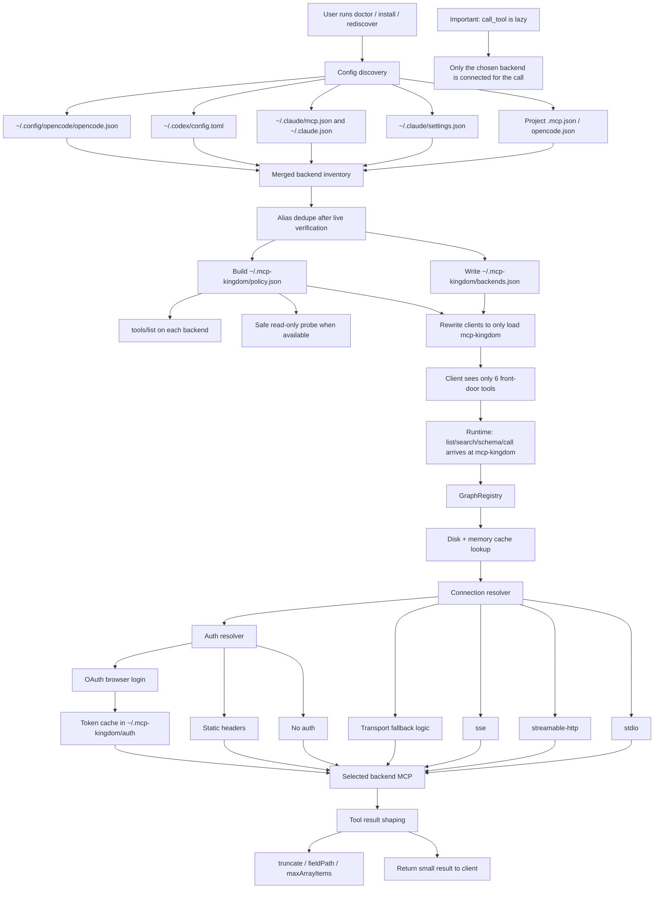

# mcp-kingdom

`mcp-kingdom` is a progressive-disclosure MCP gateway.

Instead of exposing every tool from every connected MCP server up front, `mcp-kingdom` exposes a small, stable tool surface and lazily indexes and proxies backend MCP servers only when the agent asks for them.

Supporting docs:

- [Install Guide](INSTALL.md)
- [Architecture](docs/architecture.md)
- [Trust Model](docs/trust-model.md)

## Why This Exists

When agents connect to many MCP servers directly, they pay for it twice:

- tool definitions get loaded up front
- large intermediate tool results bounce through the agent loop

`mcp-kingdom` keeps the top-level surface small and shifts backend tool discovery to runtime.

## What It Does

`mcp-kingdom` exposes only these tools:

- `list_servers`
- `search_tools`
- `get_tool_schema`
- `call_tool`
- `batch_call_tools`
- `refresh_cache`

For Claude Code `v2.1.121+`, `mcp-kingdom` marks `search_tools`, `get_tool_schema`, and `call_tool` as `anthropic/alwaysLoad` so the core gateway path is immediately available while the less-common front-door tools can still stay deferred.

Behind the scenes it can:

- discover MCP servers from existing Claude, Codex, and OpenCode config files
- merge duplicate server definitions with deterministic precedence
- connect lazily on first use
- cache backend tool lists in memory and on disk
- generate a backend tool policy from discovered MCP schemas
- collapse verified alias-only duplicate backends into one canonical server while preserving dropped names as aliases
- adapt known transport mismatches like Coralogix-style `type: "sse"` configs that really speak streamable HTTP
- preserve auth-gated backends behind `mcp-kingdom` and expose an OAuth bootstrap command for them
- safely probe read-only backend tools with zero required arguments during install
- proxy stdio, streamable HTTP, and SSE MCP servers
- shape large tool results with output modes, field projection, and array limiting
- snapshot your existing MCP inventory into a dedicated backend config file
- rewrite supported client configs so they load only `mcp-kingdom`
- trim Claude MCP permissions down to the `mcp-kingdom` front door while preserving generic Bash/file/web permissions
- scrub stale backend `mcp__server__tool` entries from `~/.claude/settings.local.json`
- update client-native allowlists where the client actually supports them
- install global helper commands like `claude-stats`, `opencode-stats`, and `mcp-kingdom-rediscover`
- back up rewritten client config files before changing them
- expose inventory counts so you can verify how much tool surface moved behind the gateway

## Architecture

Recommended install model:

1. Snapshot your current MCP inventory into a backend file.
2. Reconfigure Claude Desktop / Claude Code / Codex / OpenCode to load only `mcp-kingdom`.
3. Let `mcp-kingdom` discover, search, and call the backend MCPs on demand.

This gives you token savings without depending on any external code-executor repo.

### Flow Diagram



Under the hood:

- discovery is local and dynamic per machine
- install snapshots the discovered MCPs and rewires clients to one front door
- policy generation verifies backend tool inventories and keeps auth-gated/failing backends behind the gateway
- runtime calls go through cache, connection resolution, auth handling, and result shaping
- `call_tool` is targeted and lazy; it does not fan out to every backend MCP

## Install

### Clone and build

```sh
git clone https://github.com/ashrafxbilal/mcp-kingdom.git
cd mcp-kingdom
npm install
npm run doctor
npm run setup
```

That default setup flow:

- builds the repo
- launches an interactive install preview with an ASCII banner
- discovers supported local clients dynamically
- snapshots existing MCPs into `~/.mcp-kingdom`
- rewrites Claude / Codex / OpenCode to point at this local clone
- installs helper commands into a user bin directory so common checks can run from anywhere

If you only want the build without rewriting local configs:

```sh
npm run build
```

Then run the CLI locally:

```sh
node dist/cli.js --help
```

The installer rewrites supported client configs to point at this local clone by absolute path. It does not require a published npm package.

For client-specific setup and verification, see [INSTALL.md](INSTALL.md).

## Quick Start

### 1. Install from a local clone

```sh
git clone https://github.com/ashrafxbilal/mcp-kingdom.git
cd mcp-kingdom
npm install
npm run doctor
npm run setup
```

If you want to target specific clients:

```sh
npm run doctor
npm run setup:claude
npm run setup:codex
npm run setup:opencode
node dist/cli.js install --targets claude,codex,opencode
```

This install command:

- discovers your existing MCPs from supported configs
- writes `~/.mcp-kingdom/backends.json`
- writes `~/.mcp-kingdom/policy.json`
- performs backend verification with `tools/list` and safe read-only probes when available
- backs up and rewrites supported client configs so they point only to this local `mcp-kingdom` checkout
- trims Claude-side MCP permissions to `mcp-kingdom` only instead of mirroring every backend tool back into Claude
- cleans stale backend MCP permission overrides from `~/.claude/settings.local.json`
- installs helper commands like `claude-stats`, `opencode-stats`, `mcp-kingdom-doctor`, `mcp-kingdom-rediscover`, and `mcp-kingdom-inspect`

Supported install targets:

- Claude Desktop / Claude Code
- Codex
- OpenCode

### Zero-Config Behavior

`mcp-kingdom` is already dynamic in the parts that matter for clone-and-run installs:

- it discovers client configs from the local machine instead of hardcoding paths into the repo
- it rewrites clients to the absolute path of the current clone
- it keeps state in `~/.mcp-kingdom`, not in the repo checkout
- it migrates older `~/.mcp-graph` auth/snapshot state forward
- it supports local exclusions like `--exclude-servers blade-mcp`

For most users, the intended flow is:

```sh
git clone https://github.com/ashrafxbilal/mcp-kingdom.git
cd mcp-kingdom
npm install
npm run doctor
npm run setup
npm run verify
```

`npm run doctor` does a real dry-run of setup:

- detects supported clients on the local machine
- shows which config files would be created or updated
- shows discovered backends, duplicate resolution, and policy counts
- shows helper commands that would be installed globally
- does not mutate any files

`npm run setup` is interactive by default when run in a terminal:

- shows an install banner
- explains what the installer will do
- prints the file plan before changes are made
- asks for confirmation before writing files

If you want non-interactive behavior for CI or scripting:

```sh
node dist/cli.js install --yes
```

### 2. Snapshot your current MCP inventory manually

```sh
node dist/cli.js snapshot --output ~/.mcp-kingdom/backends.json
```

This merges MCPs from the local machine into one backend file.

Default auto-discovery looks at:

- `.mcp.json` in the current working directory
- `opencode.json` in the current working directory
- `~/.claude/settings.json`
- `~/.claude/mcp.json`
- `~/.claude.json`
- `~/.config/opencode/opencode.json`
- `~/.opencode.json`
- `~/.codex/config.toml`

### 3. Configure a client manually if you do not use the installer

Example `~/.claude.json` entry:

```json
{
  "mcpServers": {
    "mcp-kingdom": {
      "command": "/absolute/path/to/node",
      "args": ["/absolute/path/to/mcp-kingdom/dist/cli.js"],
      "env": {
        "MCP_KINGDOM_CONFIG_PATH": "/Users/your-user/.mcp-kingdom/backends.json",
        "MCP_KINGDOM_AUDIT_LOG_PATH": "/Users/your-user/.mcp-kingdom/audit.log",
        "MCP_KINGDOM_POLICY_PATH": "/Users/your-user/.mcp-kingdom/policy.json"
      }
    }
  }
}
```

If you do this, remove the other MCP entries from the active top-level config. Otherwise the client still loads them directly and you lose the context-saving benefit.

### 4. Ask the agent to use `mcp-kingdom`

Typical flow:

1. `search_tools` with a narrow query
2. `get_tool_schema` only for the relevant match
3. `call_tool` or `batch_call_tools`

## Claude Usage Stats

You can compare Claude usage directly from the repo without writing your own log parser.

Default: compare today against the previous 7 days:

```sh
npm run claude-stats
```

By default this prints a human-readable ASCII graph view. For raw JSON:

```sh
npm run claude-stats -- --json
```

When stdout is a TTY, the graph view is colorized. When output is piped or redirected, it stays plain ASCII.

Compare a specific day against the previous week:

```sh
npm run claude-stats -- --date 2026-04-27 --compare-days 7
```

Use a specific timezone or Claude projects root:

```sh
node dist/cli.js claude-stats --date today --compare-days 7 --timezone Asia/Kolkata
node dist/cli.js claude-stats --root ~/.claude/projects --date 2026-04-27
```

The report includes:

- target-day totals
- previous-window totals and daily averages
- fresh-token and total-token comparisons
- per-day breakdown for the comparison window

## OpenCode Usage Stats

You can now compare OpenCode usage from the local `opencode.db` directly from the repo.

Default: compare today against the previous 7 days:

```sh
npm run opencode-stats
```

By default this prints a human-readable ASCII graph view. For raw JSON:

```sh
npm run opencode-stats -- --json
```

When stdout is a TTY, the graph view is colorized. When output is piped or redirected, it stays plain ASCII.

## Measuring Savings Deterministically

The most reliable way to prove `mcp-kingdom` reduces token usage is to compare startup overhead for the exact same prompt with and without the gateway.

Use this protocol:

1. Pick a disposable directory with no extra repo instructions.
2. Use the same model for every run.
3. Start a fresh client session each time.
4. Use the exact same prompt, for example: `Reply with OK only.`
5. Compare the first assistant turn only.

For Claude Code, the cleanest metric is the first-turn `cache_creation_input_tokens`. That number captures how much hidden startup prompt/context Claude had to build before your prompt really started.

Deterministic A/B:

1. Baseline config: direct MCPs enabled, `mcp-kingdom` disabled.
2. Gateway config: only `mcp-kingdom` enabled.
3. Run the same one-turn prompt 5 times in each config.
4. Compare the median first-turn startup tokens.

Interpretation:

- lower `cache_creation_input_tokens` on the first turn means lower startup prompt mass
- lower first-turn `total` or `fresh` tokens means the client paid less to begin the session
- for prompts that never touch most MCPs, `mcp-kingdom` should win clearly
- for prompts that eventually fan into many backend MCPs, the gap will shrink

What to compare:

- Claude:
  - first-turn `cache_creation_input_tokens`
  - first-turn `total = input + output + cache read + cache creation`
- OpenCode:
  - one-turn session token delta from the DB for the same prompt

Important:

- compare medians, not a single run
- do not compare across different repos/models/prompts
- do not use long multi-turn sessions for this benchmark
- do not rely only on daily totals; use controlled one-turn sessions

Compare a specific day:

```sh
npm run opencode-stats -- --date 2026-04-27 --compare-days 7
```

Filter to one project:

```sh
node dist/cli.js opencode-stats --project /absolute/project/path --date today
```

The report includes:

- target-day totals
- previous-window totals and daily averages
- fresh-token, total-token, and cost comparisons
- per-day breakdown for the comparison window

## Adding New MCPs

If you add a new MCP later, you do not edit `mcp-kingdom` itself.

Add the MCP to your normal client config first, then run:

```sh
npm run rediscover
npm run verify
```

`npm run rediscover` is the intended post-change command:

- `mcp-kingdom` re-discovers MCPs from the local machine
- it merges the newly discovered MCPs into `~/.mcp-kingdom/backends.json`
- it regenerates `~/.mcp-kingdom/policy.json`
- it rewrites supported clients back to only `mcp-kingdom`, so you do not accidentally leave the new MCP active directly and lose the token benefit

## Different Users, Different MCPs

The repo does not assume your MCP inventory matches anyone else's.

Each user gets a machine-local snapshot based on whatever exists on their system at install time. Discovery is driven by:

- `.mcp.json` in the current working directory
- `opencode.json` in the current working directory
- `~/.claude/settings.json`
- `~/.claude/mcp.json`
- `~/.claude.json`
- `~/.config/opencode/opencode.json`
- `~/.opencode.json`
- `~/.codex/config.toml`

That means two users can clone the same repo and end up with different `~/.mcp-kingdom/backends.json` snapshots, which is the correct behavior.

## Codex Integration

Codex can also point at `mcp-kingdom` instead of loading every MCP directly.

Example `~/.codex/config.toml` snippet:

```toml
[mcp_servers.mcp-kingdom]
command = "/absolute/path/to/node"
args = ["/absolute/path/to/mcp-kingdom/dist/cli.js"]
env = { MCP_KINGDOM_CONFIG_PATH = "/Users/your-user/.mcp-kingdom/backends.json", MCP_KINGDOM_AUDIT_LOG_PATH = "/Users/your-user/.mcp-kingdom/audit.log", MCP_KINGDOM_POLICY_PATH = "/Users/your-user/.mcp-kingdom/policy.json" }
```

As with Claude, the token benefit comes only if `mcp-kingdom` is the primary active MCP surface.

Codex does not currently expose a client-side per-MCP tool allowlist in `config.toml`. `mcp-kingdom` therefore uses the generated runtime policy file as the effective backend allowlist for Codex installs.

Practical Codex optimization with this repo:

- keep only `mcp-kingdom` under `[mcp_servers]` in [config.toml](/Users/bilal.ashraf/.codex/config.toml)
- use `npm run rediscover` after adding MCPs instead of leaving direct MCP entries active beside `mcp-kingdom`
- keep duplicate backend aliases out of the snapshot when possible, because they increase tool search noise even if `call_tool` stays lazy
- use `doctor` and `verify` to make sure Codex still sees one front door and the backends remain behind it

## OpenCode Integration

OpenCode can load `mcp-kingdom` as a local MCP server:

```json
{
  "$schema": "https://opencode.ai/config.json",
  "mcp": {
    "mcp-kingdom": {
      "type": "local",
      "command": ["/absolute/path/to/node", "/absolute/path/to/mcp-kingdom/dist/cli.js"],
      "enabled": true,
      "environment": {
        "MCP_KINGDOM_CONFIG_PATH": "/Users/your-user/.mcp-kingdom/backends.json",
        "MCP_KINGDOM_AUDIT_LOG_PATH": "/Users/your-user/.mcp-kingdom/audit.log",
        "MCP_KINGDOM_POLICY_PATH": "/Users/your-user/.mcp-kingdom/policy.json"
      }
    }
  }
}
```

As with Claude and Codex, the token benefit comes only if the other MCPs are moved behind the backend snapshot and `mcp-kingdom` is the only active front-door MCP.

Do not copy Claude-style permission keys like `mcp__server__tool` into OpenCode. OpenCode permissions use its own tool-name patterns, and MCP permissions should be expressed with OpenCode wildcards like `mcp-kingdom_*` only if you need to override the default behavior. By default, OpenCode already allows tools to run.

## CLI

### Run the server

```sh
node dist/cli.js
```

### Snapshot merged MCP config

```sh
node dist/cli.js snapshot --output ~/.mcp-kingdom/backends.json
```

### Inspect discovered servers and duplicate resolution

```sh
node dist/cli.js inspect
```

### Preview setup changes

```sh
node dist/cli.js doctor
```

### Re-discover MCPs after adding one

```sh
node dist/cli.js rediscover
```

### Summarize Claude usage

```sh
node dist/cli.js claude-stats --date today --compare-days 7
```

### Summarize OpenCode usage

```sh
node dist/cli.js opencode-stats --date today --compare-days 7
```

With backend tool counts:

```sh
node dist/cli.js inspect --tool-counts
```

After `install`, `inspect` automatically falls back to `~/.mcp-kingdom/backends.json` when your active client configs contain only `mcp-kingdom`.

`inspect --tool-counts` now includes per-server connection details such as the selected fallback strategy, effective transport, and remediation for auth-gated or unavailable servers.

For auth-gated backends such as Slack or Spinnaker:

```sh
node dist/cli.js auth login --server slack
node dist/cli.js auth login --server remote-spinnaker-mcp-server
```

### Install and rewrite supported clients

```sh
node dist/cli.js install
```

Options:

- `--targets claude,codex,opencode`
- `--backend /custom/path/backends.json`
- `--audit-log /custom/path/audit.log`
- `--policy /custom/path/policy.json`
- `--strict-verify`
- `--verify-timeout-ms 8000`
- `--dry-run`

## Environment Variables

- `MCP_KINGDOM_CONFIG_PATH`: explicit backend config file(s). If set, `mcp-kingdom` uses these paths instead of auto-discovery.
- `MCP_KINGDOM_INCLUDE_CODEX`: set to `false` to ignore `~/.codex/config.toml` during auto-discovery.
- `MCP_KINGDOM_INCLUDE_DISABLED_OPENCODE`: set to `true` to include OpenCode MCP entries with `enabled: false`.
- `MCP_KINGDOM_EXCLUDE_SERVERS`: comma-separated server names to ignore.
- `MCP_KINGDOM_AUDIT_LOG_PATH`: optional JSONL audit log path.
- `MCP_KINGDOM_POLICY_PATH`: explicit backend policy file. Defaults to `~/.mcp-kingdom/policy.json`.
- `MCP_KINGDOM_AUTH_DIR`: persisted OAuth state used by `auth login`. Defaults to `~/.mcp-kingdom/auth`.
- `MCP_KINGDOM_CACHE_DIR`: override the persistent tool-index cache directory.
- `MCP_KINGDOM_TOOL_CACHE_TTL_MS`: set the on-disk tool cache TTL in milliseconds.

## Duplicate Resolution

When the same server name appears in multiple configs, `mcp-kingdom` keeps one definition using this precedence:

1. explicit backend config path
2. project `.mcp.json`
3. project `opencode.json`
4. `~/.claude/mcp.json`
5. `~/.claude.json`
6. `~/.claude/settings.json`
7. `~/.config/opencode/opencode.json` / `~/.opencode.json`
8. `~/.codex/config.toml`

Within the same source tier, stdio entries beat remote entries because they are usually richer and more portable.

## Supported Backends

- stdio via `command` + `args`
- streamable HTTP via `url` and `type`/`transport`
- SSE via `type = "sse"`

## Smoke Test

```sh
npm run smoke-test
```

This spins up a local mock MCP backend, indexes it through `mcp-kingdom`, and verifies both tool discovery and proxy invocation.

## Test Matrix

```sh
npm run check
npm test
npm run test:coverage
npm run smoke-test
```

Current automated coverage includes:

- config discovery and duplicate resolution across Claude, Codex, and OpenCode
- install rewrites and backup behavior
- persistent on-disk tool index caching
- result shaping for large structured tool outputs
- GraphRegistry proxy behavior
- end-to-end stdio serving through the public CLI

## Limitations

- auth handshakes beyond static headers are not implemented yet
- `call_tool` returns truncated previews by default to reduce context growth
- this project is a gateway, not a code sandbox or workflow runtime
- tool counts in `inspect --tool-counts` and `list_servers(includeToolCounts=true)` still require contacting backends once to build the inventory

## Roadmap

- richer auth support for remote MCP servers
- opt-in subgraph policies for grouping or hiding backend tools
- optional workflow execution DSL on top of batch calls
- subprocess-aware coverage collection for CLI child-process paths

## Development

```sh
npm run check
npm test
npm run build
npm run smoke-test
```
